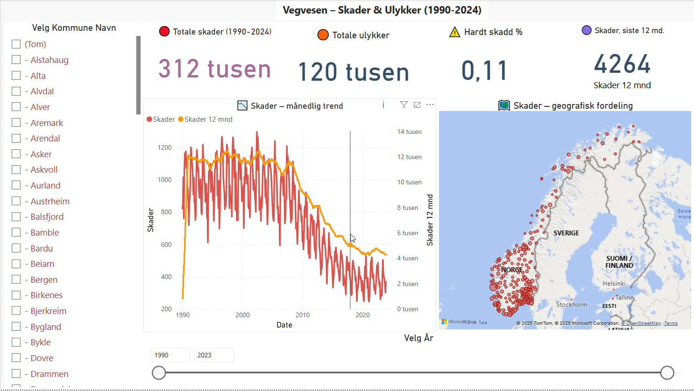
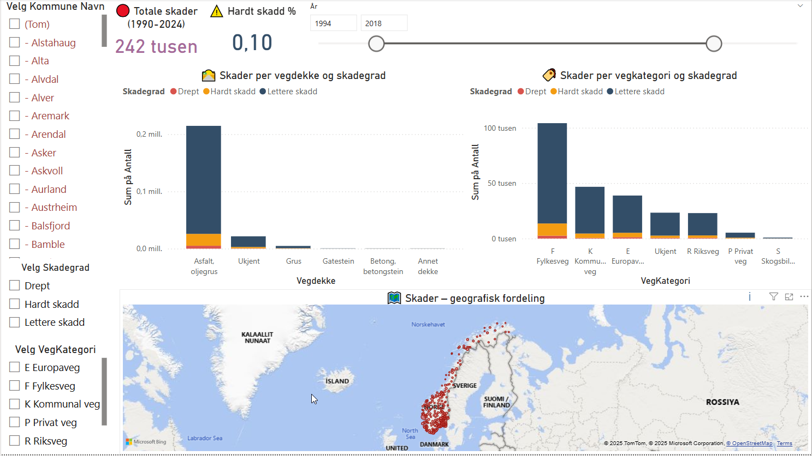
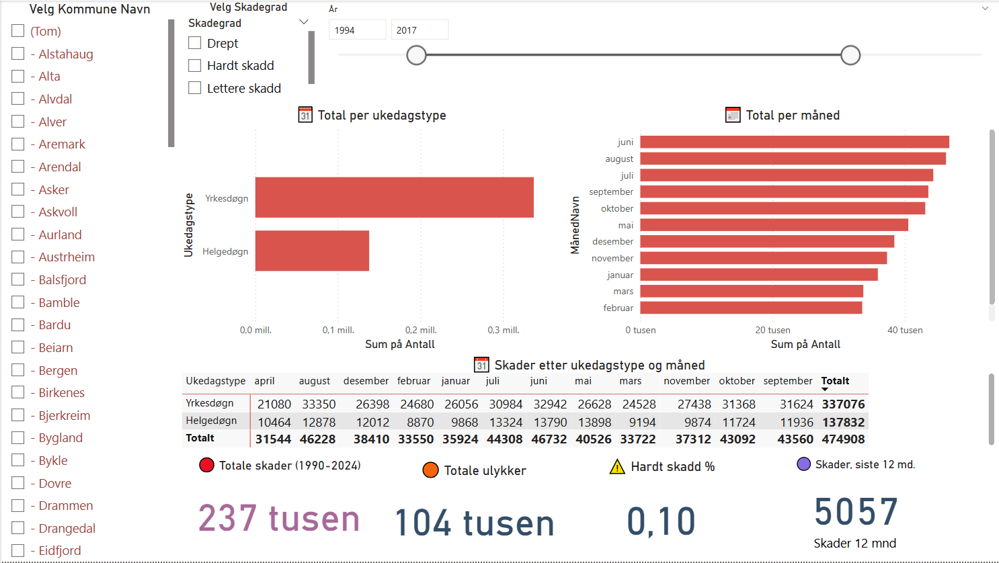
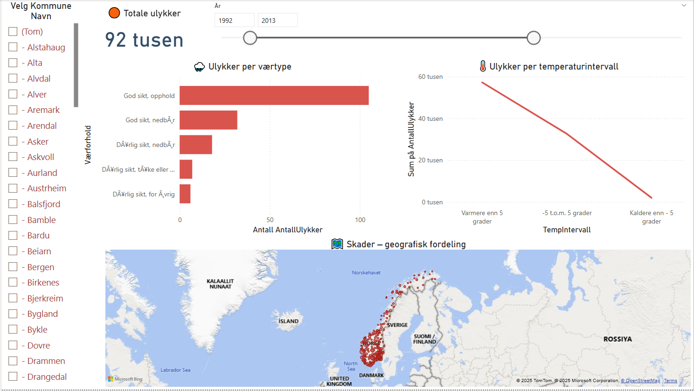
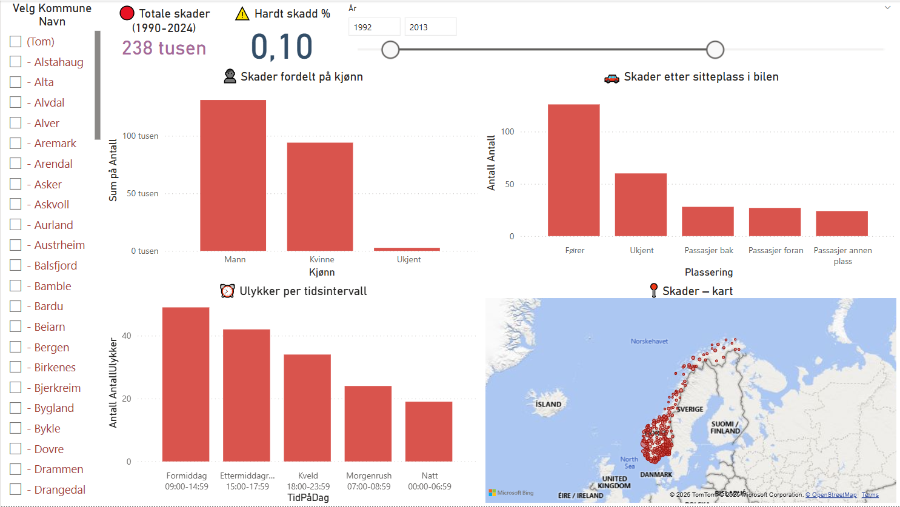

# Vegvesen – Skader & Ulykker 🚧

> **Power BI-rapport som analyserer trafikkskader og ulykker basert på Statens vegvesen-data**

[](https://powerbi.microsoft.com) [](LICENSE)

---

## 📑 Innhold

| Nr | Seksjon | Hva finner du her |
|----|---------|------------------|
| 1 | [Oversikt](#1-oversikt) | Hvorfor rapporten finnes, kjappe hovedfunn |
| 2 | [Prosjektstruktur](#2-prosjektstruktur) | Mapper & filer i repoet |
| 3 | [Datakilder](#3-datakilder) | CSV-filene fra Statens vegvesen |
| 4 | [Installasjon](#4-installasjon) | Klone repo + åpne `.pbix` |
| 5 | [Rapport-sider](#5-rapport-sider) | Skjermbilder & forklaringer |
| 6 | [Tema-fil](#6-tema-fil) | Tilpassing av farger (JSON) |
| 7 | [Google Drive-mappe](#7-google-drive-mappe) | Rådata og skjermbilder i skyen |
| 8 | [Lisens](#8-lisens) | MIT-lisensen |

---

## 1 Oversikt

Dette prosjektet visualiserer **personskader og ulykker** registrert av Statens vegvesen (1990 – 2024).

Målet er å avdekke:

* hvilke **veger** og **dekker** som gir størst risiko  
* hvordan **vær, temperatur og ukedag** påvirker ulykkes­bildet  
* om skadegrad varierer med **tid på døgnet, kjønn og sitteplass**

> Rapporten er laget i Power BI og kan oppdateres automatisk når nye CSV-filer legges til i `data/` eller i Google Drive-mappen.

---

## 2 Prosjektstruktur

```text
Vegvesen_data_analyse_BI/
├── data/                 # 8 CSV-filer fra Vegvesen
├── skjermbilder/         # PNG-shots av ferdig rapport
│   ├── bilde1.png
│   ├── bilde2.png
│   └── …
├── Vegvesen_analyse.pbix # Selve rapportfilen
├── vegvesen_tema.json    # Farge-/logo-tema for Power BI
└── README.md             # Denne fila
```

---

## 3 Datakilder

| Filnavn | Innhold | Rader |
|---------|---------|-------|
| skader_ukedagstype_ny.csv | Skader pr ukedagstype og måned | 57 k |
| skder_vegtilstand_ny.csv  | Skader pr vegdekke & kategori  | 57 k |
| skader_kommune_kjønn_ny_latlon.csv | Kjønn-fordeling med geo | 9 k |
| skader_skadegrad_ny.csv   | Drept / hardt / lettere skadd  | 52 k |
| skader_plassering_ny_latlon.csv | Plassering i kjøretøy + geo | 10 k |
| Ulykke_med_time_latlon.csv | Tidsintervall på døgnet        | 9 k |
| Ulykker_med_temp_latlon.csv | Temperaturintervall           | 9 k |
| Ulykker_med_værforhold_latlon.csv | Værforhold                | 9 k |

Alle filer er semikolon-separerte (`;`) og UTF‑8-kodet.

---

## 4 Installasjon

```bash
git clone https://github.com/<ditt-brukernavn>/Vegvesen_data_analyse_BI.git
cd Vegvesen_data_analyse_BI
```

1. Åpne **`Vegvesen_analyse.pbix`** i Power BI Desktop (mars 2024 +).  
2. Bekreft at **databane** for CSV-mappen peker til `./data/…`  
3. Klikk **Transform Data ▸ Close & Apply** for å innlese kildene.  
4. Importer tema‐filen: *Visuelt format ▸ Tema ▸ Importer tema* → `vegvesen_tema.json`.

---

## 5 Rapport‑sider

| Side | Beskrivelse | Skjermbilde |
|------|-------------|-------------|
| Hoved | KPI-kort, trendlinje og kart med bobler |  |
| Vegdekke | Skader pr vegdekke & vegkategori, stablet etter skadegrad |  |
| Ukedag × Måned | Heat‑map + totalgrafer |  |
| Vær & Temp | Ulykker pr værtype og temperaturintervall |  |
| Kjønn & Plassering | Fordeling kjønn, sitteplass, tid på døgnet + KPI |  |

---

## 6 Tema‑fil

`vegvesen_tema.json` definerer palett:

* **Skader** – `#D9544D` (rød)  
* **Ulykker** – `#F39C12` (oransje)

---

## 7 Google Drive‑mappe

Alle rå‑CSV‑ene og skjermbildene finnes også i Drive-mappen:  
<https://drive.google.com/drive/folders/1Vdej7pYWmoEpMi01JO9vIw1MrwISMuWL?usp=sharing>

---

## 8 Lisens

Distribuert under **MIT-lisensen** – se `LICENSE` for detaljer.

